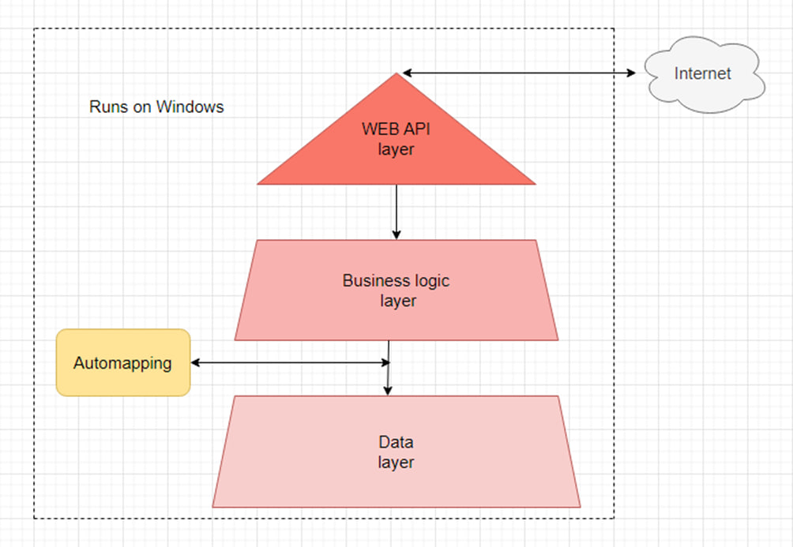
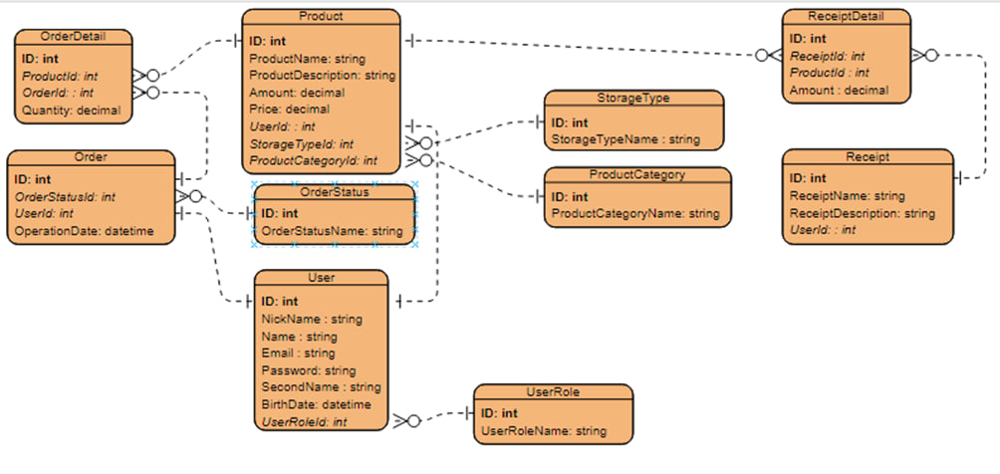

# Shop-Of-Things

## Concept Idea
Website that offers affordable products and enables users to create recipes instantly. This project aims to address the need for a platform where people can find cheaper products and easily generate recipes.

## Description of features
- The programm was made with an onion architecture.
- The program was made taking into account all the SOLID principles.
- The program was made using different patterns.
- Special features:
    - JWT authentication and authorization.
    - Hashed password with salt.
    - Product recommendation based on the ones you bought.
    - Recipe recommendations based on the foods you have.
    - Using of GUID instead of int one.
    - Get full income of bought and not bought products by category. 
    - Get income of products in category in period.
    - Get users with the largest number of uploaded receipts, products and orders. 
    - Get the most popular products(products, that users buy more other ones).
    - Get number of products in every category.
    - Get number of users of every age category.
## Architecture




## How to test
[File](https://github.com/MrSampy/Shop-Of-Things/blob/main/TESTING.md) with instructions.

## CI/CD
[](https://github.com/MrSampy/Shop-Of-Things/actions/workflows/dotnet.yml)</br>
Short instruction for docker:
- docker build -t 'image-name' . --no-cache
- docker run -p 5000:80 -t 'image-name'
- Link http://localhost:5000/swagger you will have an ability to test api

### Requirements
- NET 6.0 SDK
- ASP.NET 6
- IDE for C#(.NET). Rider(preferred) or Visual Studio 2019+

## Design Document
See [design document](https://drive.google.com/file/d/1RoyaEf8bPM2jQT0QtKtrTDgMn94I6Mm9/view).

## Authors
Kolosov Serhii — [@MrSampy](www.t.me/MrSampy)

## Contributing
If you have any ideas for improving the program, feel free to add new Issues on the [Issues page](https://github.com/MrSampy/Shop-Of-Things/issues).

## License
>**Note**: This program is distributed under an MIT License.

## Difficulties, I have faced
- I couldn't add authorization and authentication for a long time because all the manuals I read didn't mention the code, which was an important part of my system. </br>
Startup.cs
```c#
 services.AddAuthorization(options =>
            {
                var defaultAuthorizationPolicyBuilder = new AuthorizationPolicyBuilder(
                    JwtBearerDefaults.AuthenticationScheme);

                defaultAuthorizationPolicyBuilder =
                    defaultAuthorizationPolicyBuilder.RequireAuthenticatedUser();

                options.DefaultPolicy = defaultAuthorizationPolicyBuilder.Build();
            });
```
 - I had some bugs with mapping entities. It was due to function .ReverseMap(). Now I understand, that it will be better to write ways of mapping for every case separately.
 - During testing of Data layer, I face with the problem of tracking of entities. So, the problem was solved by rewriting Update methods.

## Future
1. Add FrontEnd part.
2. Add more unique features. 
