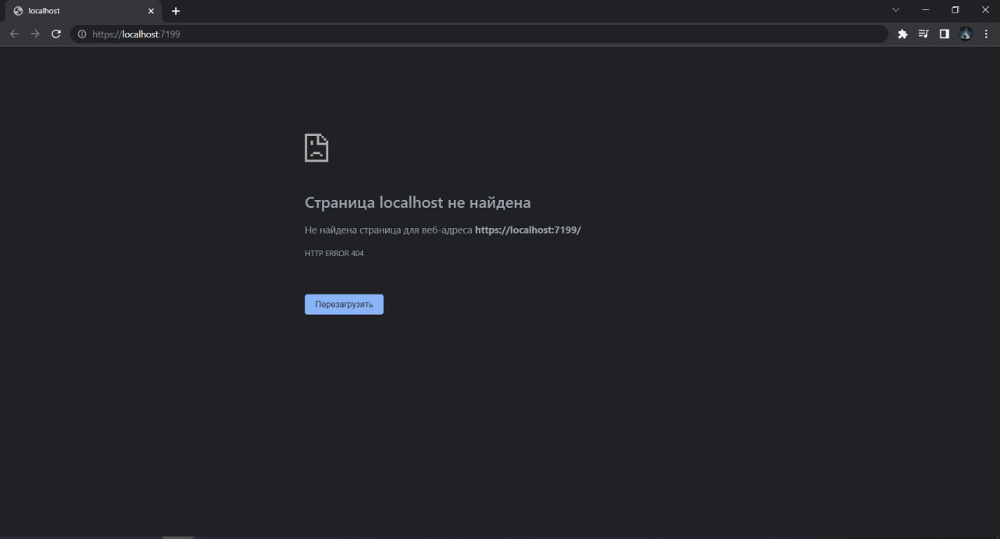
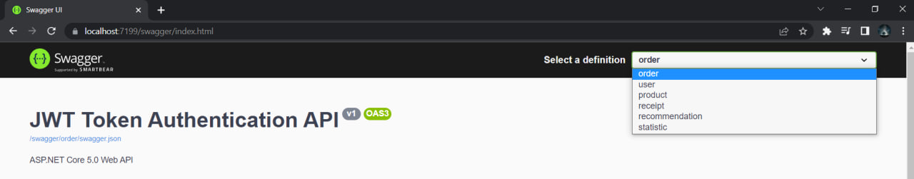
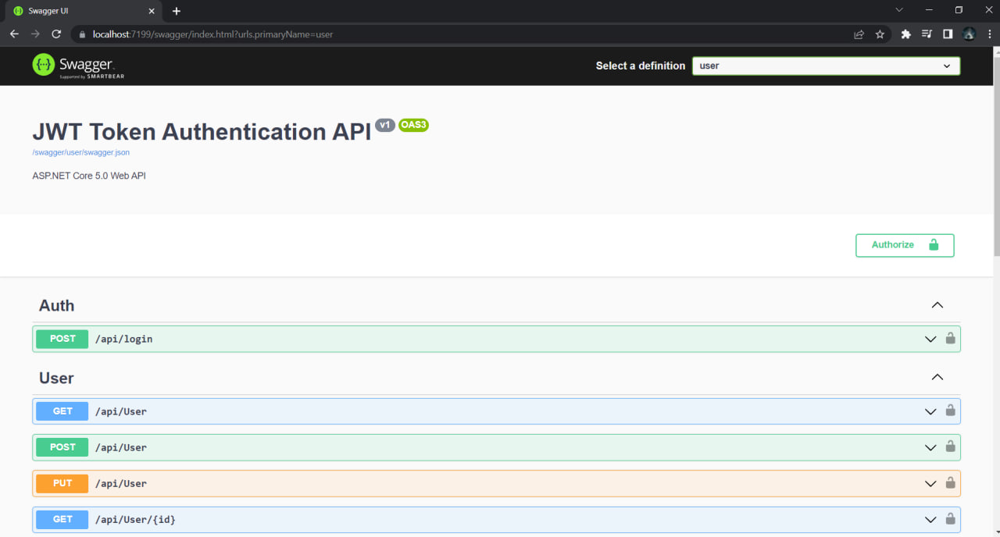
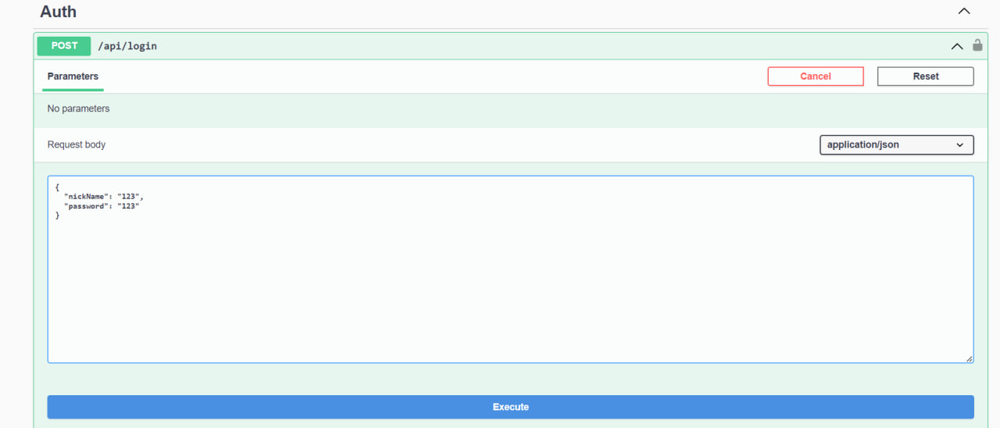
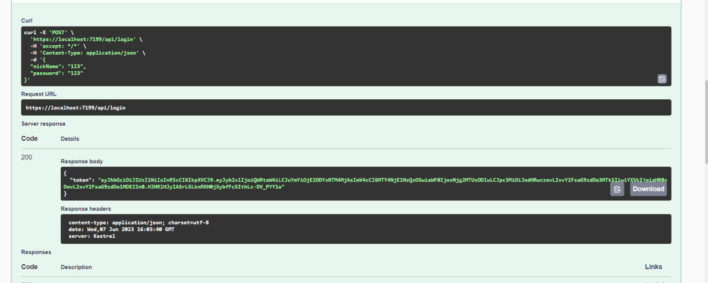
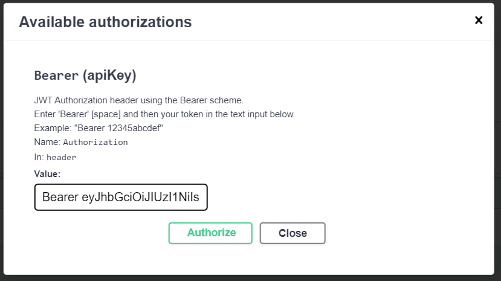
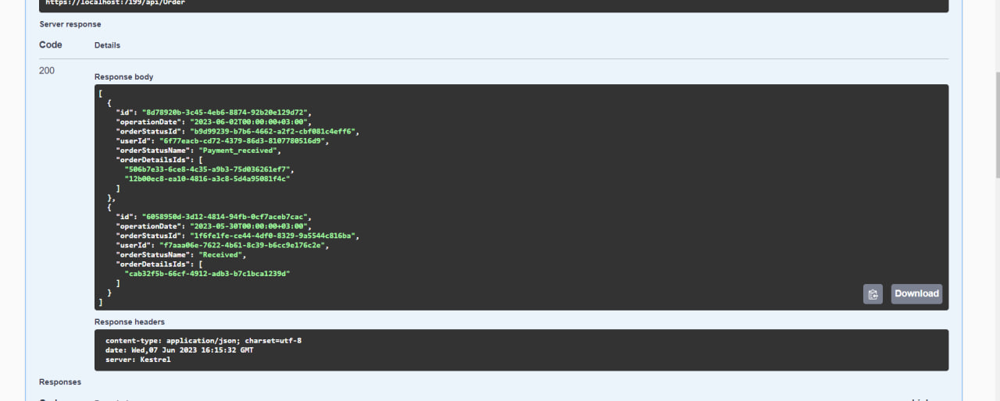
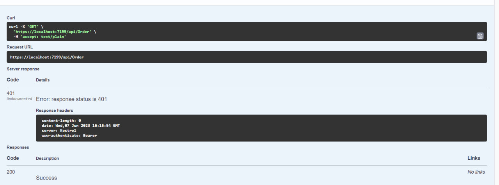

# Instructions, how test project

## 1.Fisrt of all you must run WebApi project

## 2.Then you need to add to out link "/swagger/index.html"

## 3.Then you can choose, the controller you want to test

## 4.Then you need to authorize by entering the nickname and password to api/login method

## 5.Now you have JWT token.

## 6.You need click on green icon with lock. Then you need to past your token in such format: "Bearer 'your token'". 

## 7.Congratulation! Youve authorized! Now you can test your methods.

## 8.If you dont authorize, you will have such result:

